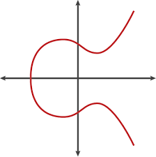

## Eliptic Curve Cryptography 101

An elliptic curve is defined by formula:

a and b are parameters that define the curve and are carefully tuned.

Secp256k1 curve (defined through Standards for Efficient Cryptography) used by Bitcoin (and others) has the formula

 (a = 0, b = 7) and looks like this:

### Operations

We operate on points on the curve A, B, C, G, P (upper-case letters) all define points on the curve with an (x, y) coordinate.

#### Addition

We can define addition of two points A and B by drawing a line through those two points and where the line intersects the curve is the negative of the new point. After transposition over the x axis (y = 0) we get the actual result.

Addition is:
* commutative: A + B = B + A
* associative (A + B) + C = A + (B + C)

#### Multiplications with a scalar

We can also calculate an addition of point P with itself (P + P)
Since this is just one point we now draw a tangent to the curve (t)

P + P is the same as 2*P

P + P + P is 3*P 

and so on.

So we can define multiplication in the form of k * P (while P * Q or P * k) doesn't make sense.

Multiplication is distributive (k * (A + B) = kA + kB)

#### Discrete logarithm problem

From k -> kP is easy (we just do the adding or actually doubling) but kP -> k is very hard.

Usually we are given a standard curve (like Secp256k1) and some generator point G. Note: in principle any G is good but we cannot trust just any parameters because peer might know something about G beforehand (there were attacks abusing the blind trust of G sent by other party).

BTW on Bitcoin:
x(G) = 0x79BE667EF9DCBBAC55A06295CE870B07029BFCDB2DCE28D959F2815B16F81798
y(G) = 0x483ADA7726A3C4655DA4FBFC0E1108A8FD17B448A68554199C47D08FFB10D4B8

Basically random integer x can be a private key, while P = x*G is the public key. And knowing P or G doesn't help in any way to find out x. This is the elliptic curve discrete logarithm problem that is believed to be computationaly hard.

Private key is usually a 256 bit long integer. It appears that P would have 512 bits (256 bits for x and 256 bits for y coordinate), but it actually suffices to use just one coordinate (due to the nature of elliptic curves) and one additional bit. So the representation of P is just 257 bits long.

[Previous - main page](./README.md) 

[Next - Schnorr Signature Scheme](./schnorr.md)