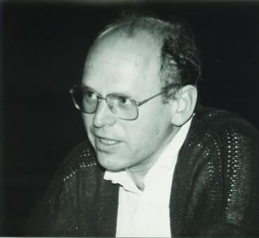

## Schnorr Signature Scheme

(Image: Claus-Peter Schnorr - from Wikipedia)

The scheme was invented by german mathematician Claus-Peter Schnorr.

Unfortunately he patented the scheme in 1988 (patent expired in February 2008). So during the creation of Bitcoin it was "free", unfortunately the space lacked good libraries. Therefore ECDSA scheme was used (which is more complicated on purpose to not violate the patent).

### Signature

Signature is the pair (R, s) that must be in a certain relation

We choose a random integer k and calculate

R = k*G

(ECC magic to hide it into R)

and s is defined as

**s = k - h*d**

(sometimes - is also + doesn't really matter)

k is that random number, d is your private key, public key is P=d*G.

h is hash(message || R || P)

### Verification

if we multiply s by publicly known G

we get the

s * G = k * G  - (h * d)*G

s * G = k * G - d*G * h

s * G = R - P * h

h = hash(message || R || P)

which we can verify since we have all that public data:
- public key P
- value R
- the actual message

### Forging an invalid signature

We could choose random R and calculate

R - hash(R)

however we cannot divide by G to get proper s

We can start with random k and calculate real R

but we don't know d so there is no way to forge signature.

### Randomness of k

k is called nonce since it must be used exactly once

If it isn't you can factor out d - which is your private key!

### Difference with ECDSA

In ECDSA calculation of s involves a division by k (which is not publicly known).

### Mu-Sig (n-of-n)

Due to linearity it is possible to "compress" multiple public keys into one and then also signers can cooperate and produce "master" private key corresponding to the master public key for spending the funds.

### Ring signatures

[Abe, Okhubo, Suzuki](https://cryptoservices.github.io/cryptography/2017/07/21/Sigs.html) usage of Schnorr signatures.

Idea is that you have participants with public keys P1, P2 ... Pn.

Anyone can sign but you can't know which of them did it. Something similar is used in Monero.

### Connection to zero-knowledge proofs

Basically the signature scheme derives from an interactive zero-knowledge proof that you know a discrete logarithm d for a certain value P (P = d*G). You create a random R (R = k*G). We give the other party R and get some random value h from them.

Now we calculate s = k - h*d and can convince the other side that we know d without ever telling it (so this is a Zero-knowledge Proof of the fact we know d!)

Using something called [Fiat-Shamir heuristic](https://en.wikipedia.org/wiki/Fiat%E2%80%93Shamir_heuristic) we can transform this interactive protocol to a non-interactive one. Basically we replace other side who provides h with a hash of all involved values H(G, P, R). And since G is a constant anyway that is not really necessary.

[Previous - ECC](./ecc101.md) 

[Next - DLC](./dlc.md)
